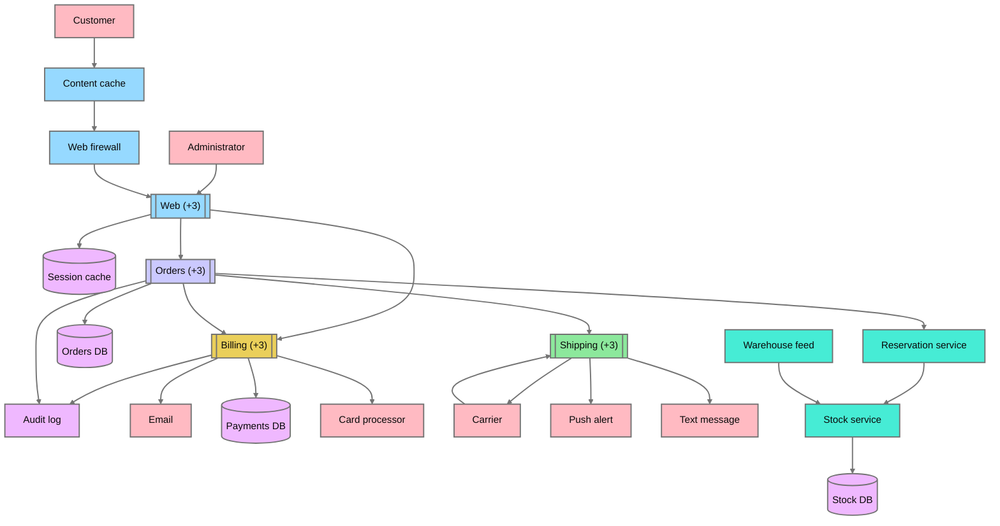
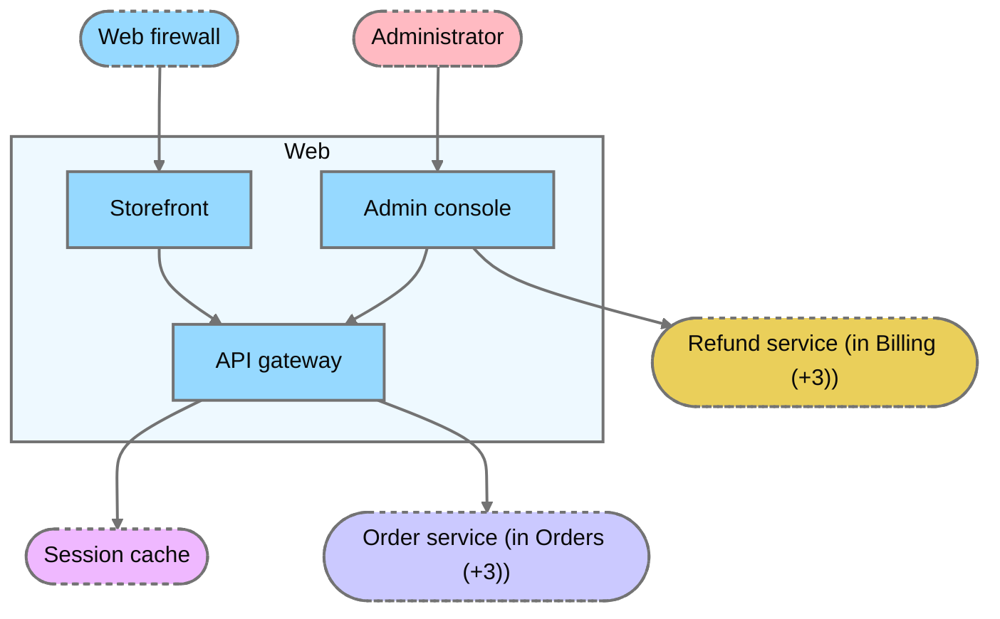
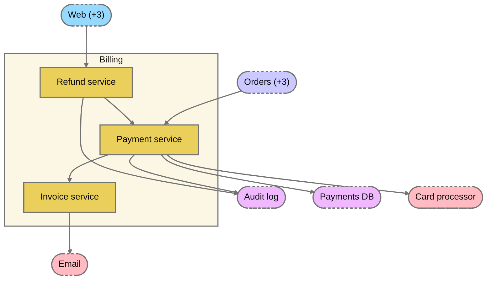
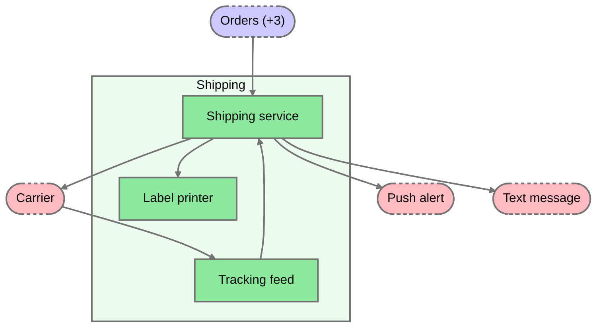
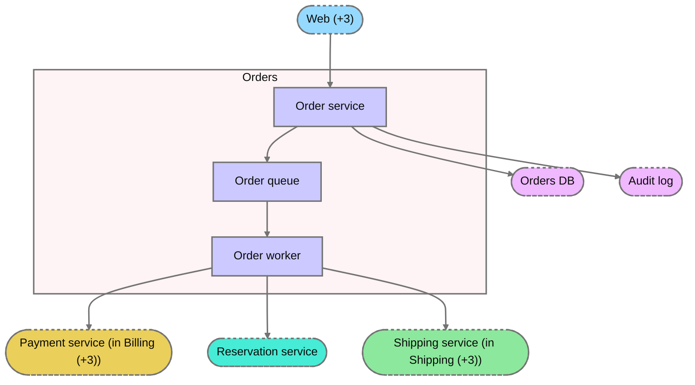

# Shop architecture

Overview and detail views retain all 29 components and 32 relationships.

## Overview

```mermaid
---
config:
  layout: dagre
  look: classic
  theme: base
  themeVariables:
    textColor: '#0a0a0a'
    primaryTextColor: '#0a0a0a'
    edgeLabelBackground: '#ffffff'
    lineColor: '#737373'
---
flowchart TB
  ADMIN["Administrator"]
  g1[["Web (+3)"]]
  CACHE[("Session cache")]
  g2[["Billing (+3)"]]
  g4[["Orders (+3)"]]
  LOG["Audit log"]
  MAIL["Email"]
  PDB[("Payments DB")]
  PSP["Card processor"]
  DB[("Orders DB")]
  g3[["Shipping (+3)"]]
  RES["Reservation service"]
  CAR["Carrier"]
  PUSH["Push alert"]
  SMS["Text message"]
  SS["Stock service"]
  SDB[("Stock DB")]
  CUST["Customer"]
  CDN["Content cache"]
  WAF["Web firewall"]
  WH["Warehouse feed"]
  ADMIN --> g1
  g1 --> CACHE
  g1 --> g2
  g1 --> g4
  g2 --> LOG
  g2 --> MAIL
  g2 --> PDB
  g2 --> PSP
  g4 --> g2
  g4 --> LOG
  g4 --> DB
  g4 --> g3
  g4 --> RES
  g3 --> CAR
  g3 --> PUSH
  g3 --> SMS
  RES --> SS
  CAR --> g3
  SS --> SDB
  CUST --> CDN
  CDN --> WAF
  WAF --> g1
  WH --> SS
  classDef web fill:#96d9ff,stroke:#737373,color:#0a0a0a,stroke-width:2px
  classDef orders fill:#cbc9ff,stroke:#737373,color:#0a0a0a,stroke-width:2px
  classDef billing fill:#eacf5a,stroke:#737373,color:#0a0a0a,stroke-width:2px
  classDef shipping fill:#8ce89c,stroke:#737373,color:#0a0a0a,stroke-width:2px
  classDef stock fill:#46ecd5,stroke:#737373,color:#0a0a0a,stroke-width:2px
  classDef external fill:#ffbac2,stroke:#737373,color:#0a0a0a,stroke-width:2px
  classDef data fill:#efb8ff,stroke:#737373,color:#0a0a0a,stroke-width:2px
  class ADMIN external
  class g1 web
  class CACHE data
  class g2 billing
  class g4 orders
  class LOG data
  class MAIL external
  class PDB data
  class PSP external
  class DB data
  class g3 shipping
  class RES stock
  class CAR external
  class PUSH external
  class SMS external
  class SS stock
  class SDB data
  class CUST external
  class CDN web
  class WAF web
  class WH stock
  linkStyle default stroke:#737373,stroke-width:2px
```

## Web detail

```mermaid
---
config:
  layout: dagre
  look: classic
  theme: base
  themeVariables:
    textColor: '#0a0a0a'
    primaryTextColor: '#0a0a0a'
    edgeLabelBackground: '#ffffff'
    lineColor: '#737373'
---
flowchart TB
  s1(["Administrator"])
  s4(["Refund service (in Billing (+3))"])
  s2(["Session cache"])
  s3(["Order service (in Orders (+3))"])
  s5(["Web firewall"])
  subgraph web["Web"]
    ADM["Admin console"]
    API["API gateway"]
    UI["Storefront"]
  end
  s1 --> ADM
  ADM --> API
  ADM --> s4
  API --> s2
  API --> s3
  s5 --> UI
  UI --> API
  classDef stub stroke-dasharray:4
  class s1,s2,s3,s4,s5 stub
  classDef web fill:#96d9ff,stroke:#737373,color:#0a0a0a,stroke-width:2px
  classDef orders fill:#cbc9ff,stroke:#737373,color:#0a0a0a,stroke-width:2px
  classDef billing fill:#eacf5a,stroke:#737373,color:#0a0a0a,stroke-width:2px
  classDef shipping fill:#8ce89c,stroke:#737373,color:#0a0a0a,stroke-width:2px
  classDef stock fill:#46ecd5,stroke:#737373,color:#0a0a0a,stroke-width:2px
  classDef external fill:#ffbac2,stroke:#737373,color:#0a0a0a,stroke-width:2px
  classDef data fill:#efb8ff,stroke:#737373,color:#0a0a0a,stroke-width:2px
  class s1 external
  class s4 billing
  class s2 data
  class s3 orders
  class s5 web
  class ADM web
  class API web
  class UI web
  style web fill:#eef9ff,stroke:#737373,color:#0a0a0a,stroke-width:2px
  linkStyle default stroke:#737373,stroke-width:2px
```

## Billing detail

```mermaid
---
config:
  layout: dagre
  look: classic
  theme: base
  themeVariables:
    textColor: '#0a0a0a'
    primaryTextColor: '#0a0a0a'
    edgeLabelBackground: '#ffffff'
    lineColor: '#737373'
---
flowchart TB
  s1(["Web (+3)"])
  s3(["Audit log"])
  s5(["Payments DB"])
  s6(["Card processor"])
  s4(["Email"])
  s2(["Orders (+3)"])
  subgraph billing["Billing"]
    REF["Refund service"]
    PS["Payment service"]
    INV["Invoice service"]
  end
  s1 --> REF
  REF --> PS
  REF --> s3
  PS --> s3
  PS --> INV
  PS --> s5
  PS --> s6
  INV --> s4
  s2 --> PS
  classDef stub stroke-dasharray:4
  class s1,s2,s3,s4,s5,s6 stub
  classDef web fill:#96d9ff,stroke:#737373,color:#0a0a0a,stroke-width:2px
  classDef orders fill:#cbc9ff,stroke:#737373,color:#0a0a0a,stroke-width:2px
  classDef billing fill:#eacf5a,stroke:#737373,color:#0a0a0a,stroke-width:2px
  classDef shipping fill:#8ce89c,stroke:#737373,color:#0a0a0a,stroke-width:2px
  classDef stock fill:#46ecd5,stroke:#737373,color:#0a0a0a,stroke-width:2px
  classDef external fill:#ffbac2,stroke:#737373,color:#0a0a0a,stroke-width:2px
  classDef data fill:#efb8ff,stroke:#737373,color:#0a0a0a,stroke-width:2px
  class s1 web
  class s3 data
  class s5 data
  class s6 external
  class s4 external
  class s2 orders
  class REF billing
  class PS billing
  class INV billing
  style billing fill:#fcf7e5,stroke:#737373,color:#0a0a0a,stroke-width:2px
  linkStyle default stroke:#737373,stroke-width:2px
```

## Shipping detail

```mermaid
---
config:
  layout: dagre
  look: classic
  theme: base
  themeVariables:
    textColor: '#0a0a0a'
    primaryTextColor: '#0a0a0a'
    edgeLabelBackground: '#ffffff'
    lineColor: '#737373'
---
flowchart TB
  s1(["Orders (+3)"])
  s2(["Carrier"])
  s3(["Push alert"])
  s4(["Text message"])
  subgraph shipping["Shipping"]
    SHS["Shipping service"]
    LBL["Label printer"]
    TRK["Tracking feed"]
  end
  s1 --> SHS
  SHS --> LBL
  SHS --> s2
  SHS --> s3
  SHS --> s4
  s2 --> TRK
  TRK --> SHS
  classDef stub stroke-dasharray:4
  class s1,s2,s3,s4 stub
  classDef web fill:#96d9ff,stroke:#737373,color:#0a0a0a,stroke-width:2px
  classDef orders fill:#cbc9ff,stroke:#737373,color:#0a0a0a,stroke-width:2px
  classDef billing fill:#eacf5a,stroke:#737373,color:#0a0a0a,stroke-width:2px
  classDef shipping fill:#8ce89c,stroke:#737373,color:#0a0a0a,stroke-width:2px
  classDef stock fill:#46ecd5,stroke:#737373,color:#0a0a0a,stroke-width:2px
  classDef external fill:#ffbac2,stroke:#737373,color:#0a0a0a,stroke-width:2px
  classDef data fill:#efb8ff,stroke:#737373,color:#0a0a0a,stroke-width:2px
  class s1 orders
  class s2 external
  class s3 external
  class s4 external
  class SHS shipping
  class LBL shipping
  class TRK shipping
  style shipping fill:#edfbef,stroke:#737373,color:#0a0a0a,stroke-width:2px
  linkStyle default stroke:#737373,stroke-width:2px
```

## Orders detail

```mermaid
---
config:
  layout: dagre
  look: classic
  theme: base
  themeVariables:
    textColor: '#0a0a0a'
    primaryTextColor: '#0a0a0a'
    edgeLabelBackground: '#ffffff'
    lineColor: '#737373'
---
flowchart TB
  s1(["Web (+3)"])
  s2(["Orders DB"])
  s3(["Audit log"])
  s4(["Payment service (in Billing (+3))"])
  s5(["Reservation service"])
  s6(["Shipping service (in Shipping (+3))"])
  subgraph orders["Orders"]
    OS["Order service"]
    OQ["Order queue"]
    OW["Order worker"]
  end
  s1 --> OS
  OS --> OQ
  OS --> s2
  OS --> s3
  OQ --> OW
  OW --> s4
  OW --> s5
  OW --> s6
  classDef stub stroke-dasharray:4
  class s1,s2,s3,s4,s5,s6 stub
  classDef web fill:#96d9ff,stroke:#737373,color:#0a0a0a,stroke-width:2px
  classDef orders fill:#cbc9ff,stroke:#737373,color:#0a0a0a,stroke-width:2px
  classDef billing fill:#eacf5a,stroke:#737373,color:#0a0a0a,stroke-width:2px
  classDef shipping fill:#8ce89c,stroke:#737373,color:#0a0a0a,stroke-width:2px
  classDef stock fill:#46ecd5,stroke:#737373,color:#0a0a0a,stroke-width:2px
  classDef external fill:#ffbac2,stroke:#737373,color:#0a0a0a,stroke-width:2px
  classDef data fill:#efb8ff,stroke:#737373,color:#0a0a0a,stroke-width:2px
  class s1 web
  class s2 data
  class s3 data
  class s4 billing
  class s5 stock
  class s6 shipping
  class OS orders
  class OQ orders
  class OW orders
  style orders fill:#fff4f5,stroke:#737373,color:#0a0a0a,stroke-width:2px
  linkStyle default stroke:#737373,stroke-width:2px
```
