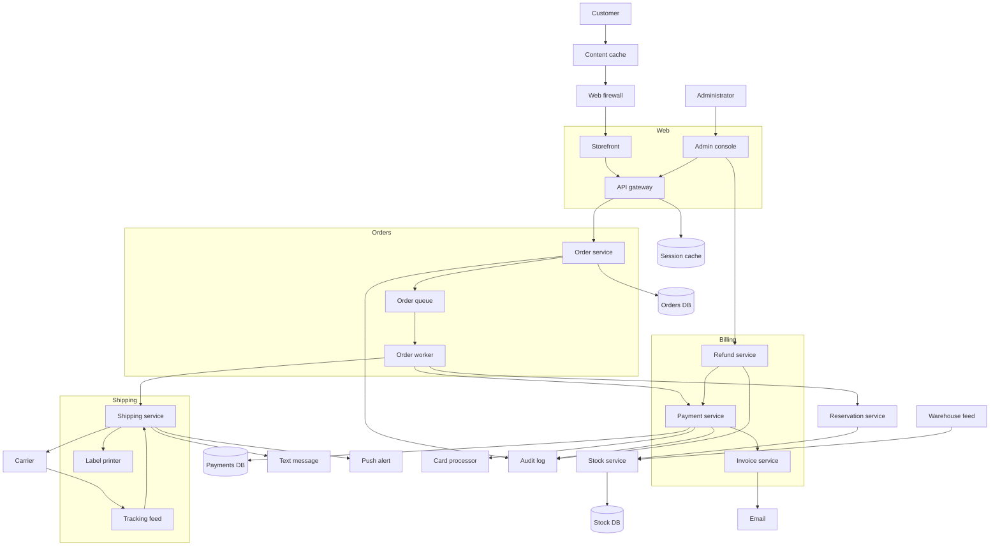

# Shop architecture

Expected VCS: 62.7 from 29 nodes, 32 edges and four author subgraphs.

```mermaid
flowchart TD
  CUST[Customer]
  ADMIN[Administrator]
  CDN[Content cache]
  WAF[Web firewall]
  subgraph web [Web]
    UI[Storefront]
    ADM[Admin console]
    API[API gateway]
  end
  subgraph orders [Orders]
    OS[Order service]
    OQ[Order queue]
    OW[Order worker]
  end
  subgraph billing [Billing]
    PS[Payment service]
    INV[Invoice service]
    REF[Refund service]
  end
  subgraph shipping [Shipping]
    SHS[Shipping service]
    LBL[Label printer]
    TRK[Tracking feed]
  end
  SS[Stock service]
  WH[Warehouse feed]
  RES[Reservation service]
  DB[(Orders DB)]
  PDB[(Payments DB)]
  SDB[(Stock DB)]
  CACHE[(Session cache)]
  MAIL[Email]
  SMS[Text message]
  PUSH[Push alert]
  PSP[Card processor]
  CAR[Carrier]
  LOG[Audit log]
  CUST --> CDN
  CDN --> WAF
  WAF --> UI
  ADMIN --> ADM
  UI --> API
  ADM --> API
  API --> CACHE
  API --> OS
  OS --> OQ
  OQ --> OW
  OW --> PS
  OW --> RES
  OS --> DB
  PS --> PDB
  PS --> PSP
  PS --> INV
  REF --> PS
  ADM --> REF
  INV --> MAIL
  RES --> SS
  SS --> SDB
  WH --> SS
  OW --> SHS
  SHS --> LBL
  SHS --> CAR
  CAR --> TRK
  TRK --> SHS
  SHS --> SMS
  SHS --> PUSH
  OS --> LOG
  PS --> LOG
  REF --> LOG
```
