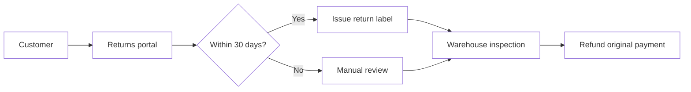

# Legacy returns routing

Family detector: `flowchart`.

```mermaid
---
config: {"themeVariables":{"primaryTextColor":"#fff","primaryColor":"#fff","mainBkg":"#fff"},"flowchart":{"defaultRenderer":"dagre-d3"}}
---
graph LR
  Customer[Customer] --> Portal[Returns portal]
  Portal --> Eligibility{Within 30 days?}
  Eligibility -->|Yes| Label[Issue return label]
  Eligibility -->|No| Review[Manual review]
  Label --> Warehouse[Warehouse inspection]
  Review --> Warehouse
  Warehouse --> Refund[Refund original payment]
```
