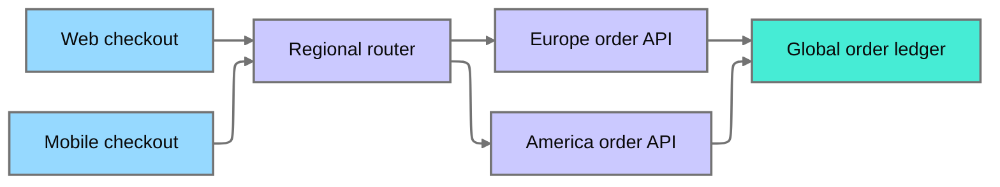

# Regional order routing

Family detector: `flowchart-elk`.

```mermaid
---
config:
  layout: elk
  look: classic
  theme: base
  themeVariables:
    primaryTextColor: '#0a0a0a'
    textColor: '#0a0a0a'
    lineColor: '#737373'
    edgeLabelBackground: '#ffffff'
---
flowchart-elk LR
  Web[Web checkout] --> Router[Regional router]
  Mobile[Mobile checkout] --> Router
  Router --> Europe[Europe order API]
  Router --> America[America order API]
  Europe --> Ledger[Global order ledger]
  America --> Ledger
  classDef client fill:#96d9ff,stroke:#737373,color:#0a0a0a,stroke-width:2px
  classDef routing fill:#cbc9ff,stroke:#737373,color:#0a0a0a,stroke-width:2px
  classDef data fill:#46ecd5,stroke:#737373,color:#0a0a0a,stroke-width:2px
  class Web,Mobile client
  class Router,Europe,America routing
  class Ledger data
  linkStyle default stroke:#737373,stroke-width:2px
```
