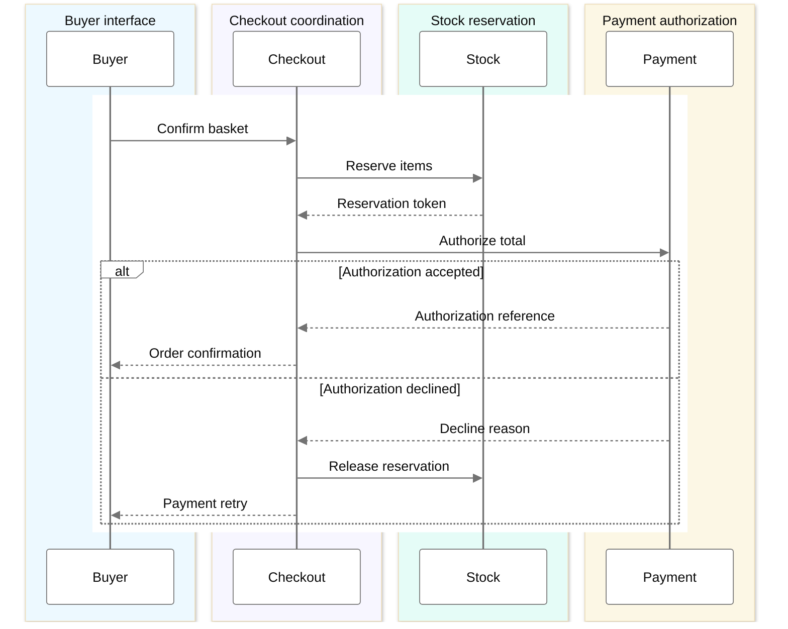

# Checkout authorization sequence

Family detector: `sequence`.

```mermaid
---
config:
  theme: base
  themeVariables:
    actorTextColor: '#0a0a0a'
    actorBkg: '#ffffff'
    actorBorder: '#737373'
    actorLineColor: '#737373'
    signalColor: '#737373'
    signalTextColor: '#0a0a0a'
    labelBoxBkgColor: '#ffffff'
    labelBoxBorderColor: '#737373'
    labelTextColor: '#0a0a0a'
    loopTextColor: '#0a0a0a'
    textColor: '#0a0a0a'
    background: '#ffffff'
---
sequenceDiagram
  box rgb(237,249,255) Buyer interface
    participant Buyer
  end
  box rgb(247,246,255) Checkout coordination
    participant Checkout
  end
  box rgb(229,252,247) Stock reservation
    participant Stock
  end
  box rgb(252,247,229) Payment authorization
    participant Payment
  end
  rect rgb(255,255,255)
    Buyer->>Checkout: Confirm basket
    Checkout->>Stock: Reserve items
    Stock-->>Checkout: Reservation token
    Checkout->>Payment: Authorize total
    alt Authorization accepted
      Payment-->>Checkout: Authorization reference
      Checkout-->>Buyer: Order confirmation
    else Authorization declined
      Payment-->>Checkout: Decline reason
      Checkout->>Stock: Release reservation
      Checkout-->>Buyer: Payment retry
    end
  end
```
