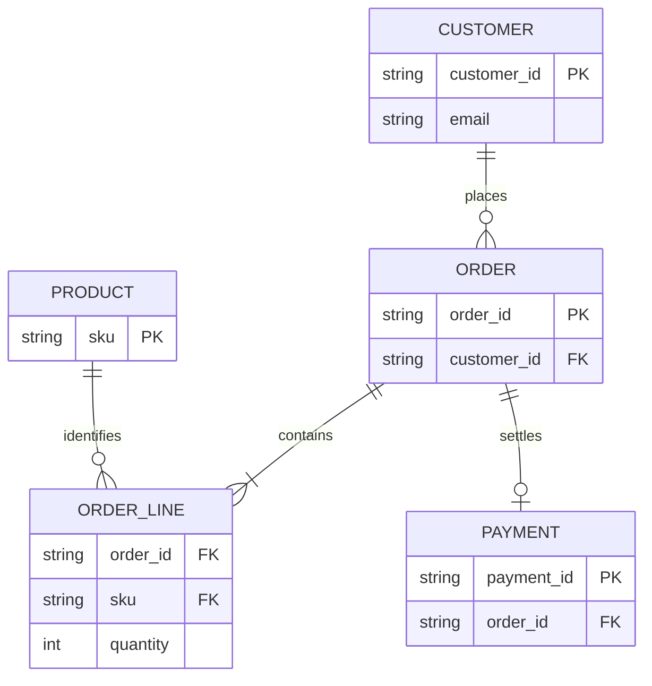

# Order storage relationships

Family detector: `er`.

```mermaid
---
config: {"themeVariables":{"primaryTextColor":"#fff","primaryColor":"#fff"}}
---
erDiagram
  CUSTOMER ||--o{ ORDER : places
  ORDER ||--|{ ORDER_LINE : contains
  PRODUCT ||--o{ ORDER_LINE : identifies
  ORDER ||--o| PAYMENT : settles
  CUSTOMER {
    string customer_id PK
    string email
  }
  ORDER {
    string order_id PK
    string customer_id FK
  }
  ORDER_LINE {
    string order_id FK
    string sku FK
    int quantity
  }
  PRODUCT {
    string sku PK
  }
  PAYMENT {
    string payment_id PK
    string order_id FK
  }
```
