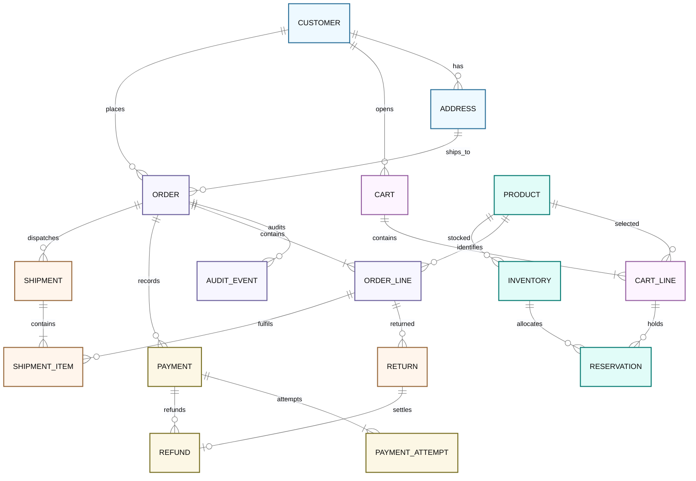
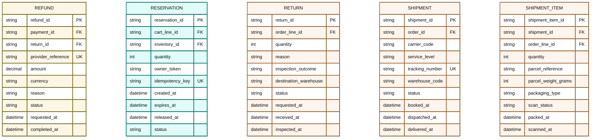

# Checkout ledger storage detail

Family detector: `er`.

## Relationship overview

```mermaid
---
config:
  layout: dagre
  theme: base
  themeVariables:
    rowOdd: '#ffffff'
    rowEven: '#f7f6ff'
    primaryTextColor: '#0a0a0a'
    textColor: '#0a0a0a'
    lineColor: '#737373'
    edgeLabelBackground: '#ffffff'
---
erDiagram
  CUSTOMER
  ADDRESS
  CART
  ORDER
  CART_LINE
  AUDIT_EVENT
  ORDER_LINE
  PAYMENT
  SHIPMENT
  RESERVATION
  RETURN
  SHIPMENT_ITEM
  PAYMENT_ATTEMPT
  REFUND
  PRODUCT
  INVENTORY
  CUSTOMER ||--o{ ADDRESS : "has"
  CUSTOMER ||--o{ CART : "opens"
  CUSTOMER ||--o{ ORDER : "places"
  ADDRESS ||--o{ ORDER : "ships_to"
  CART ||--|{ CART_LINE : "contains"
  ORDER ||--o{ AUDIT_EVENT : "audits"
  ORDER ||--|{ ORDER_LINE : "contains"
  ORDER ||--o{ PAYMENT : "records"
  ORDER ||--o{ SHIPMENT : "dispatches"
  CART_LINE ||--o{ RESERVATION : "holds"
  ORDER_LINE ||--o{ RETURN : "returned"
  ORDER_LINE ||--o{ SHIPMENT_ITEM : "fulfils"
  PAYMENT ||--|{ PAYMENT_ATTEMPT : "attempts"
  PAYMENT ||--o{ REFUND : "refunds"
  SHIPMENT ||--|{ SHIPMENT_ITEM : "contains"
  RETURN ||--o| REFUND : "settles"
  PRODUCT ||--o{ CART_LINE : "selected"
  PRODUCT ||--o{ ORDER_LINE : "identifies"
  PRODUCT ||--o{ INVENTORY : "stocked"
  INVENTORY ||--o{ RESERVATION : "allocates"
  classDef customer fill:#eef9ff,color:#0a0a0a,stroke:#266d97,stroke-width:2px
  class CUSTOMER,ADDRESS customer
  classDef cart fill:#fdf4ff,color:#0a0a0a,stroke:#92599e,stroke-width:2px
  class CART,CART_LINE cart
  classDef inventory fill:#e1fcf8,color:#0a0a0a,stroke:#00776e,stroke-width:2px
  class PRODUCT,INVENTORY,RESERVATION inventory
  classDef order fill:#f7f6ff,color:#0a0a0a,stroke:#675b99,stroke-width:2px
  class ORDER,ORDER_LINE,AUDIT_EVENT order
  classDef payment fill:#fcf7e5,color:#0a0a0a,stroke:#726819,stroke-width:2px
  class PAYMENT,PAYMENT_ATTEMPT,REFUND payment
  classDef shipment fill:#fff5ec,color:#0a0a0a,stroke:#946335,stroke-width:2px
  class SHIPMENT,SHIPMENT_ITEM,RETURN shipment
```

## Attribute detail 1

```mermaid
---
config:
  layout: dagre
  theme: base
  themeVariables:
    rowOdd: '#ffffff'
    rowEven: '#f7f6ff'
    primaryTextColor: '#0a0a0a'
    textColor: '#0a0a0a'
    lineColor: '#737373'
    edgeLabelBackground: '#ffffff'
---
erDiagram
  ADDRESS {
    string address_id PK
    string customer_id FK
    string recipient
    string street
    string city
    string region
    string postal_code
    string country
    boolean default_shipping
    datetime verified_at
  }
  AUDIT_EVENT {
    string audit_event_id PK
    string order_id FK
    string actor_id
    string action
    string correlation_id
    string source_system
    string previous_status
    string next_status
    datetime occurred_at
    datetime recorded_at
  }
  CART {
    string cart_id PK
    string customer_id FK
    string currency
    decimal subtotal
    decimal tax_total
    decimal shipping_total
    string promotion_code
    string channel
    datetime expires_at
    string status
  }
  CART_LINE {
    string cart_line_id PK
    string cart_id FK
    string sku FK
    int quantity
    decimal unit_price
    decimal tax_amount
    decimal discount_amount
    string fulfilment_region
    datetime added_at
    datetime updated_at
  }
  CUSTOMER {
    string customer_id PK
    string email UK
    string full_name
    string phone
    string loyalty_tier
    string country
    boolean marketing_opt_in
    datetime created_at
    datetime updated_at
    string status
  }
  INVENTORY {
    string inventory_id PK
    string sku FK
    string warehouse_code
    int on_hand
    int reserved
    int available
    int reorder_point
    string stock_status
    datetime counted_at
    datetime updated_at
  }
  ORDER {
    string order_id PK
    string customer_id FK
    string address_id FK
    string source_cart_id
    string currency
    decimal grand_total
    string channel
    string status
    datetime placed_at
    datetime confirmed_at
  }
  ORDER_LINE {
    string order_line_id PK
    string order_id FK
    string sku FK
    int quantity
    decimal unit_price
    decimal tax_amount
    decimal discount_amount
    string fulfilment_status
    datetime promised_at
    datetime fulfilled_at
  }
  PAYMENT {
    string payment_id PK
    string order_id FK
    string provider_reference UK
    string currency
    decimal authorized_amount
    decimal captured_amount
    decimal refunded_amount
    string status
    datetime authorized_at
    datetime captured_at
  }
  PAYMENT_ATTEMPT {
    string attempt_id PK
    string payment_id FK
    string idempotency_key UK
    string provider_code
    int attempt_number
    decimal requested_amount
    string response_code
    string outcome
    datetime started_at
    datetime completed_at
  }
  PRODUCT {
    string sku PK
    string product_name
    string category
    string brand
    decimal list_price
    string currency
    int weight_grams
    boolean hazardous
    string lifecycle_status
    datetime updated_at
  }
  classDef customer fill:#eef9ff,color:#0a0a0a,stroke:#266d97,stroke-width:2px
  class CUSTOMER,ADDRESS customer
  classDef cart fill:#fdf4ff,color:#0a0a0a,stroke:#92599e,stroke-width:2px
  class CART,CART_LINE cart
  classDef inventory fill:#e1fcf8,color:#0a0a0a,stroke:#00776e,stroke-width:2px
  class PRODUCT,INVENTORY inventory
  classDef order fill:#f7f6ff,color:#0a0a0a,stroke:#675b99,stroke-width:2px
  class ORDER,ORDER_LINE,AUDIT_EVENT order
  classDef payment fill:#fcf7e5,color:#0a0a0a,stroke:#726819,stroke-width:2px
  class PAYMENT,PAYMENT_ATTEMPT payment
```

## Attribute detail 2

```mermaid
---
config:
  layout: dagre
  theme: base
  themeVariables:
    rowOdd: '#ffffff'
    rowEven: '#f7f6ff'
    primaryTextColor: '#0a0a0a'
    textColor: '#0a0a0a'
    lineColor: '#737373'
    edgeLabelBackground: '#ffffff'
---
erDiagram
  REFUND {
    string refund_id PK
    string payment_id FK
    string return_id FK
    string provider_reference UK
    decimal amount
    string currency
    string reason
    string status
    datetime requested_at
    datetime completed_at
  }
  RESERVATION {
    string reservation_id PK
    string cart_line_id FK
    string inventory_id FK
    int quantity
    string owner_token
    string idempotency_key UK
    datetime created_at
    datetime expires_at
    datetime released_at
    string status
  }
  RETURN {
    string return_id PK
    string order_line_id FK
    int quantity
    string reason
    string inspection_outcome
    string destination_warehouse
    string status
    datetime requested_at
    datetime received_at
    datetime inspected_at
  }
  SHIPMENT {
    string shipment_id PK
    string order_id FK
    string carrier_code
    string service_level
    string tracking_number UK
    string warehouse_code
    string status
    datetime booked_at
    datetime dispatched_at
    datetime delivered_at
  }
  SHIPMENT_ITEM {
    string shipment_item_id PK
    string shipment_id FK
    string order_line_id FK
    int quantity
    string parcel_reference
    int parcel_weight_grams
    string packaging_type
    string scan_status
    datetime packed_at
    datetime scanned_at
  }
  classDef inventory fill:#e1fcf8,color:#0a0a0a,stroke:#00776e,stroke-width:2px
  class RESERVATION inventory
  classDef payment fill:#fcf7e5,color:#0a0a0a,stroke:#726819,stroke-width:2px
  class REFUND payment
  classDef shipment fill:#fff5ec,color:#0a0a0a,stroke:#946335,stroke-width:2px
  class SHIPMENT,SHIPMENT_ITEM,RETURN shipment
```
