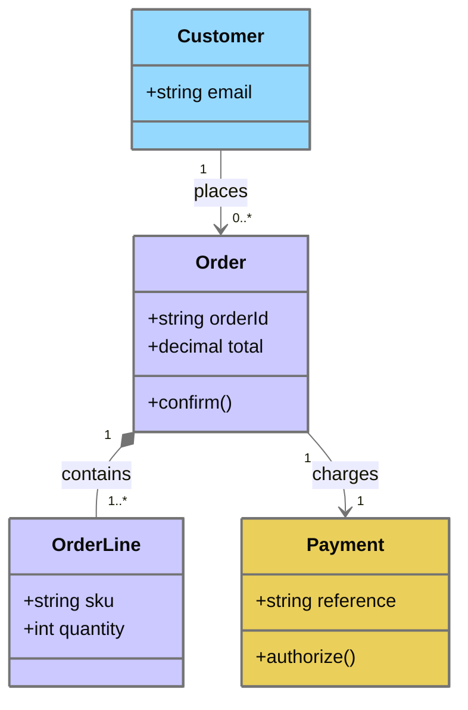

# Order domain classes

Family detector: `classDiagram`.

```mermaid
---
config:
  layout: dagre
  look: classic
  themeVariables:
    lineColor: '#737373'
---
classDiagram
  class Order {
    +string orderId
    +decimal total
    +confirm()
  }
  class OrderLine {
    +string sku
    +int quantity
  }
  class Payment {
    +string reference
    +authorize()
  }
  class Customer {
    +string email
  }
  Customer "1" --> "0..*" Order : places
  Order "1" *-- "1..*" OrderLine : contains
  Order "1" --> "1" Payment : charges
  cssClass "Customer" customer
  cssClass "Order,OrderLine" order
  cssClass "Payment" payment
  classDef customer fill:#96d9ff,color:#0a0a0a,stroke:#737373,stroke-width:2px
  classDef order fill:#cbc9ff,color:#0a0a0a,stroke:#737373,stroke-width:2px
  classDef payment fill:#eacf5a,color:#0a0a0a,stroke:#737373,stroke-width:2px
```
