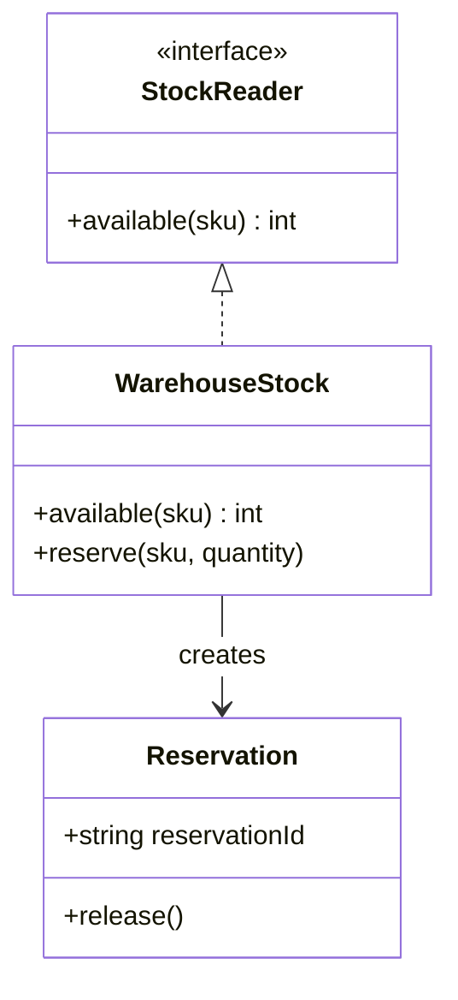

# Legacy inventory interfaces

Family detector: `class`.

```mermaid
---
config: {"themeVariables":{"primaryTextColor":"#fff","primaryColor":"#fff","mainBkg":"#fff"},"class":{"defaultRenderer":"dagre-d3"}}
---
classDiagram
  class StockReader {
    <<interface>>
    +available(sku) int
  }
  class WarehouseStock {
    +available(sku) int
    +reserve(sku, quantity)
  }
  class Reservation {
    +string reservationId
    +release()
  }
  StockReader <|.. WarehouseStock
  WarehouseStock --> Reservation : creates
```
