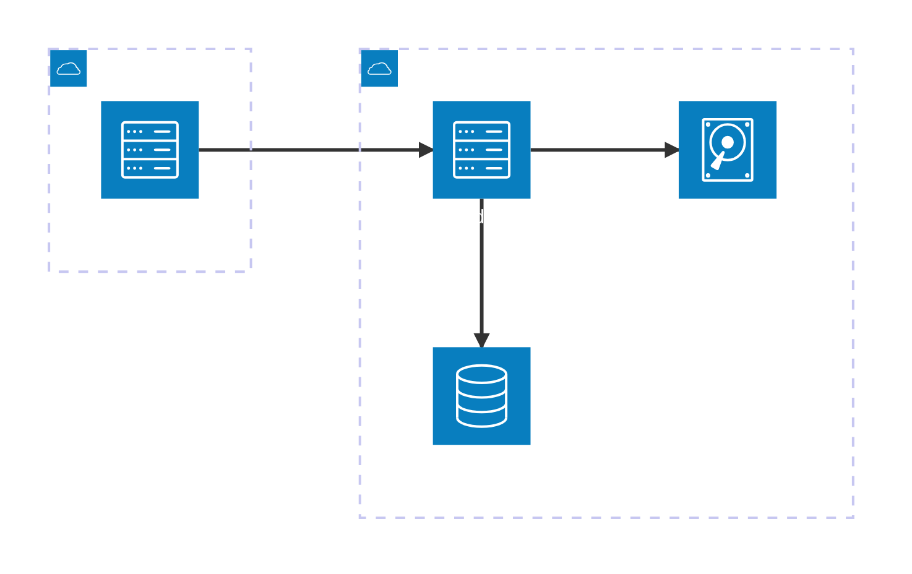

# Checkout infrastructure

Family detector: `architecture`.

```mermaid
---
config: {"themeVariables":{"textColor":"#fff"}}
---
architecture-beta
  group edge(cloud)[Public edge]
  group core(cloud)[Private services]
  service gateway(server)[Gateway] in edge
  service orders(server)[Orders] in core
  service database(database)[Order database] in core
  service queue(disk)[Fulfilment queue] in core
  gateway:R --> L:orders
  orders:B --> T:database
  orders:R --> L:queue
```
