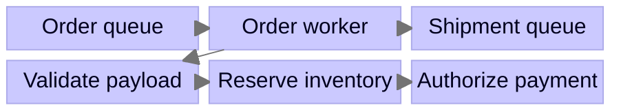

# Order worker stages

Family detector: `block`.

```mermaid
---
config:
  theme: base
  themeVariables:
    textColor: '#0a0a0a'
    primaryTextColor: '#0a0a0a'
    mainBkg: '#cbc9ff'
    primaryColor: '#cbc9ff'
    lineColor: '#737373'
---
block-beta
  columns 3
  input["Order queue"] worker["Order worker"] output["Shipment queue"]
  validation["Validate payload"] reservation["Reserve inventory"] payment["Authorize payment"]
  input --> worker
  worker --> output
  worker --> validation
  validation --> reservation
  reservation --> payment
```
