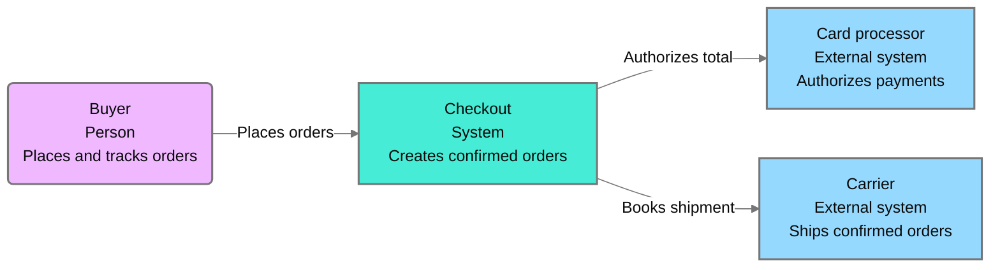

# Checkout system context

Family detector: `c4`.

This flowchart preserves the C4 context while avoiding fixed black arrowheads on dark canvases.

```mermaid
---
config:
  layout: dagre
  look: classic
  theme: base
  themeVariables:
    lineColor: '#767676'
    edgeLabelBackground: '#ffffff'
    primaryTextColor: '#0a0a0a'
---
flowchart LR
  buyer@{ shape: rounded, label: "Buyer<br/>Person<br/>Places and tracks orders" }
  checkout["Checkout<br/>System<br/>Creates confirmed orders"]
  bank["Card processor<br/>External system<br/>Authorizes payments"]
  carrier["Carrier<br/>External system<br/>Ships confirmed orders"]
  buyer -->|Places orders| checkout
  checkout -->|Authorizes total| bank
  checkout -->|Books shipment| carrier
  classDef person fill:#efb8ff,color:#0a0a0a,stroke:#767676,stroke-width:2px
  classDef system fill:#46ecd5,color:#0a0a0a,stroke:#767676,stroke-width:2px
  classDef external fill:#96d9ff,color:#0a0a0a,stroke:#767676,stroke-width:2px
  class buyer person
  class checkout system
  class bank,carrier external
```
