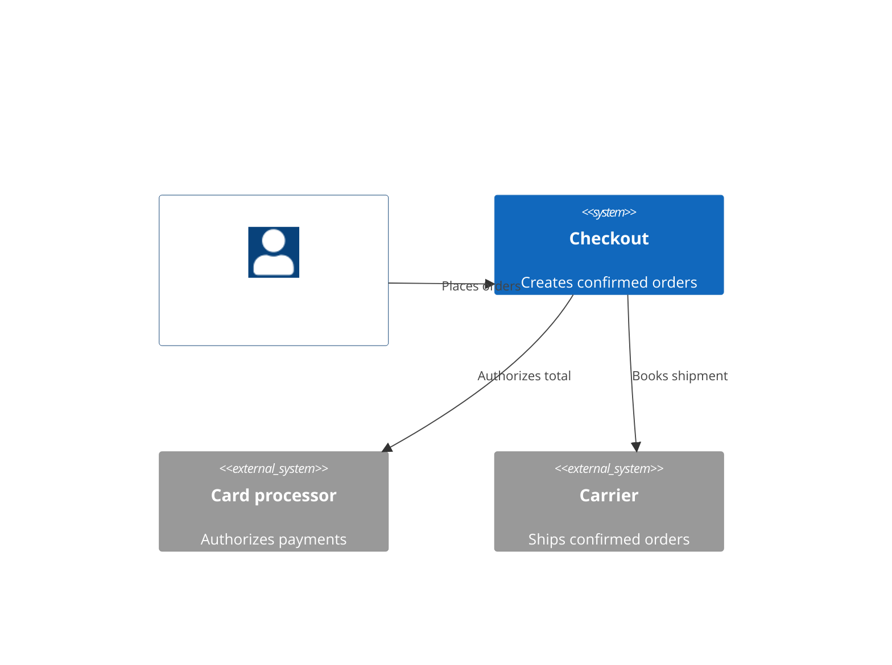

# Checkout system context

Family detector: `c4`.

```mermaid
---
config: {"c4":{"person_bg_color":"#fff"}}
---
C4Context
  Person(buyer, "Buyer", "Places and tracks orders")
  System(checkout, "Checkout", "Creates confirmed orders")
  System_Ext(bank, "Card processor", "Authorizes payments")
  System_Ext(carrier, "Carrier", "Ships confirmed orders")
  Rel(buyer, checkout, "Places orders")
  Rel(checkout, bank, "Authorizes total")
  Rel(checkout, carrier, "Books shipment")
```
