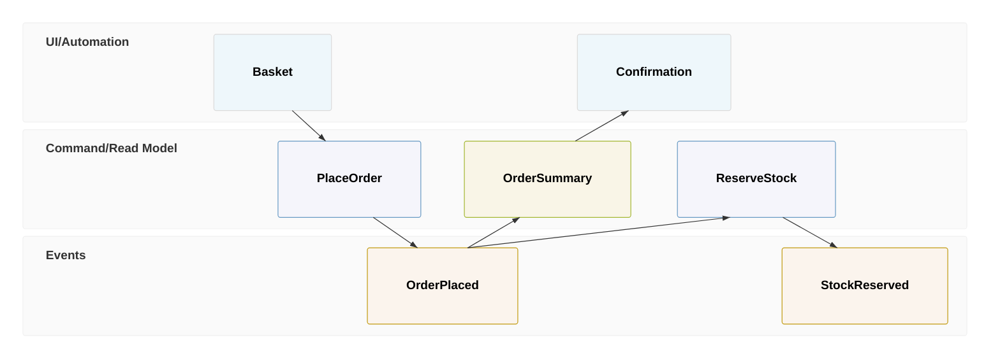

# Order placement event model

Family detector: `eventmodeling`.

```mermaid
---
config:
  themeVariables:
    emUiFill: 'rgba(150,217,255,0.12)'
    emCommandFill: 'rgba(203,201,255,0.12)'
    emEventFill: 'rgba(255,193,136,0.12)'
    emReadModelFill: 'rgba(234,207,90,0.12)'
---
eventmodeling
  tf 01 ui Basket
  tf 02 cmd PlaceOrder
  tf 03 evt OrderPlaced
  tf 04 rmo OrderSummary
  tf 05 ui Confirmation ->> 04
  tf 06 cmd ReserveStock ->> 03
  tf 07 evt StockReserved
```
