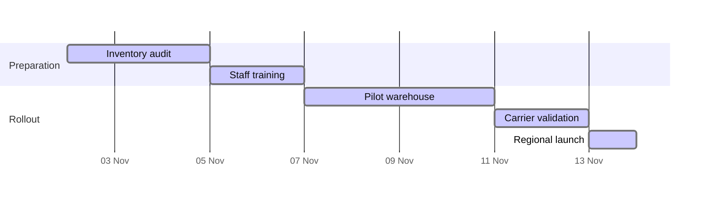

# Warehouse rollout schedule

Family detector: `gantt`.

```mermaid
---
config:
  themeVariables:
    taskTextColor: '#0a0a0a'
    taskTextDarkColor: '#0a0a0a'
    taskTextLightColor: '#0a0a0a'
    taskBkgColor: '#cbc9ff'
    taskBorderColor: '#737373'
---
gantt
  dateFormat YYYY-MM-DD
  axisFormat %d %b
  tickInterval 2day
  section Preparation
  Inventory audit :audit, 2026-11-02, 3d
  Staff training :train, after audit, 2d
  section Rollout
  Pilot warehouse :pilot, after train, 4d
  Carrier validation :carrier, after pilot, 2d
  Regional launch :launch, after carrier, 1d
```
