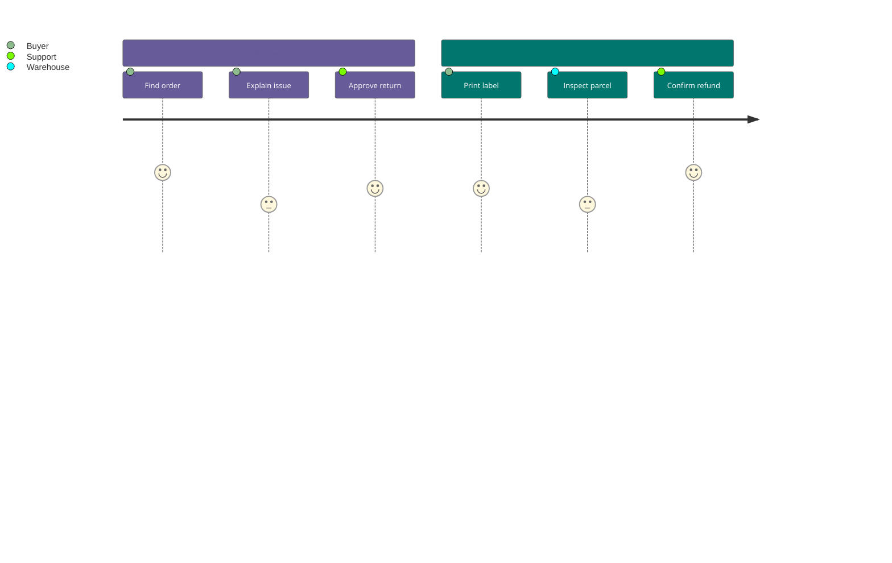

# Buyer returns journey

Family detector: `journey`.

```mermaid
---
config:
  journey:
    textPlacement: tspan
    sectionFills: ['#675b99', '#00776e']
    sectionColours: ['#ffffff', '#ffffff']
    actorColours: ['#96d9ff', '#eacf5a', '#8ce89c']
  themeVariables:
    fillType0: '#675b99'
    fillType1: '#00776e'
---
journey
  section Request
    Find order: 5: Buyer
    Explain issue: 3: Buyer
    Approve return: 4: Support
  section Fulfilment
    Print label: 4: Buyer
    Inspect parcel: 3: Warehouse
    Confirm refund: 5: Support
```
