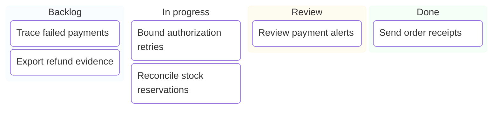

# Checkout release work

Family detector: `kanban`.

```mermaid
---
config:
  themeVariables:
    cScale2: 'rgba(150,217,255,0.12)'
    cScale3: 'rgba(203,201,255,0.12)'
    cScale4: 'rgba(234,207,90,0.12)'
    cScale5: 'rgba(140,232,156,0.12)'
---
kanban
  backlog[Backlog]
    tracing[Trace failed payments]
    export[Export refund evidence]
  progress[In progress]
    retry[Bound authorization retries]
    stock[Reconcile stock reservations]
  review[Review]
    alert[Review payment alerts]
  done[Done]
    receipt[Send order receipts]
```
