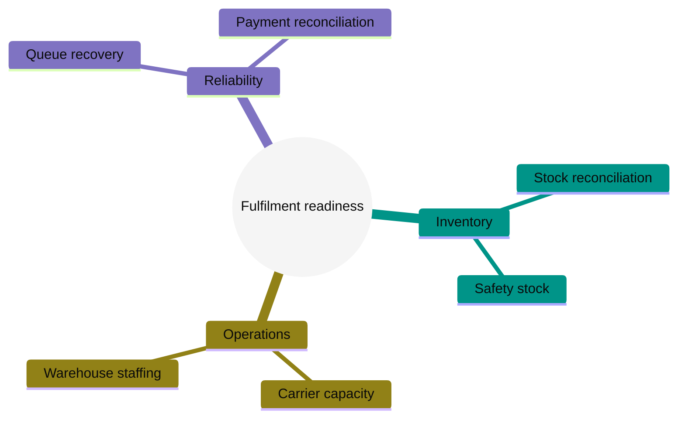

# Fulfilment readiness checklist

Family detector: `mindmap`.

```mermaid
---
config:
  themeVariables:
    git0: '#f5f5f5'
    gitBranchLabel0: '#0a0a0a'
    cScale1: '#009488'
    cScaleLabel1: '#0a0a0a'
    cScale2: '#918117'
    cScaleLabel2: '#0a0a0a'
    cScale3: '#7f73c2'
    cScaleLabel3: '#0a0a0a'
---
mindmap
  root((Fulfilment readiness))
    Inventory
      Stock reconciliation
      Safety stock
    Operations
      Carrier capacity
      Warehouse staffing
    Reliability
      Queue recovery
      Payment reconciliation
```
