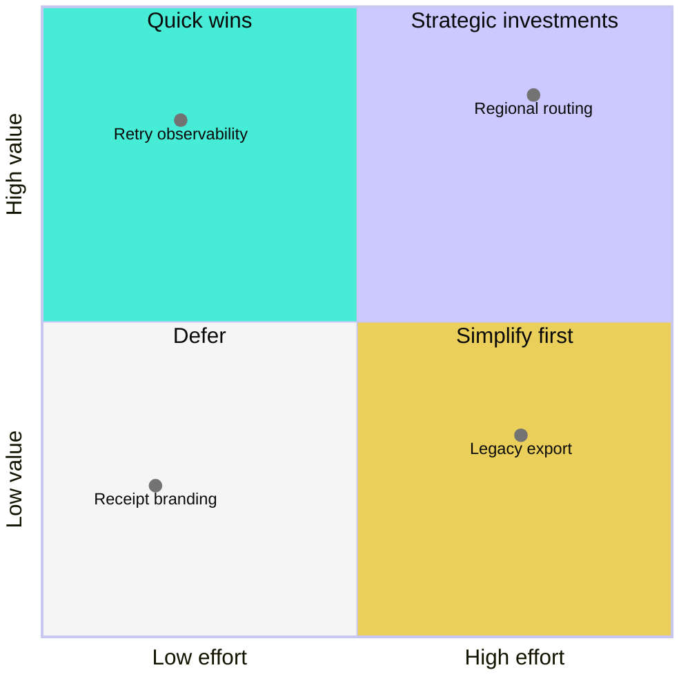

# Checkout improvement prioritisation

Family detector: `quadrantChart`.

```mermaid
---
config:
  themeVariables:
    quadrant1Fill: '#cbc9ff'
    quadrant1TextFill: '#0a0a0a'
    quadrant2Fill: '#46ecd5'
    quadrant2TextFill: '#0a0a0a'
    quadrant3Fill: '#f5f5f5'
    quadrant3TextFill: '#0a0a0a'
    quadrant4Fill: '#eacf5a'
    quadrant4TextFill: '#0a0a0a'
    quadrantPointTextFill: '#0a0a0a'
    quadrantPointFill: '#737373'
---
quadrantChart
  x-axis Low effort --> High effort
  y-axis Low value --> High value
  quadrant-1 Strategic investments
  quadrant-2 Quick wins
  quadrant-3 Defer
  quadrant-4 Simplify first
  Retry observability: [0.22,0.82]
  Regional routing: [0.78,0.86]
  Receipt branding: [0.18,0.24]
  Legacy export: [0.76,0.32]
```
