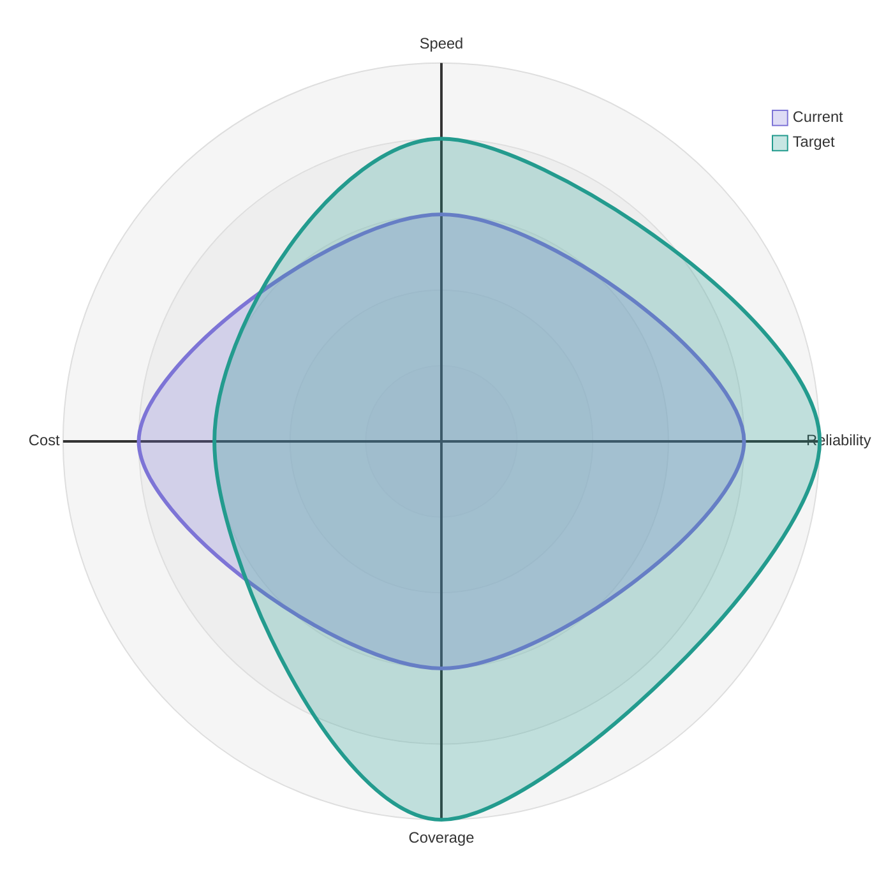

# Fulfilment capability comparison

Family detector: `radar`.

```mermaid
---
config:
  themeVariables:
    cScale0: '#7d74d6'
    cScale1: '#239b8e'
    radar:
      curveOpacity: 0.25
      curveStrokeWidth: 3
---
radar-beta
  axis speed["Speed"], reliability["Reliability"], coverage["Coverage"], cost["Cost"]
  curve current["Current"]{3,4,3,4}
  curve target["Target"]{4,5,5,3}
```
