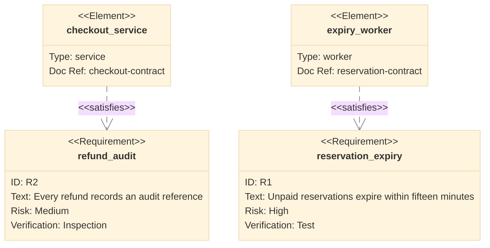

# Reservation safety requirements

Family detector: `requirement`.

```mermaid
---
config:
  layout: dagre
  look: classic
  theme: base
  themeVariables:
    requirementTextColor: '#0a0a0a'
    requirementBackground: '#cbc9ff'
    requirementBorderColor: '#675b99'
    relationColor: '#737373'
    relationLabelColor: '#0a0a0a'
    relationLabelBackground: '#ffffff'
---
requirementDiagram
  requirement reservation_expiry {
    id: R1
    text: Unpaid reservations expire within fifteen minutes
    risk: high
    verifymethod: test
  }
  requirement refund_audit {
    id: R2
    text: Every refund records an audit reference
    risk: medium
    verifymethod: inspection
  }
  element checkout_service {
    type: service
    docref: "checkout-contract"
  }
  element expiry_worker {
    type: worker
    docref: "reservation-contract"
  }
  checkout_service - satisfies -> refund_audit
  expiry_worker - satisfies -> reservation_expiry
```
