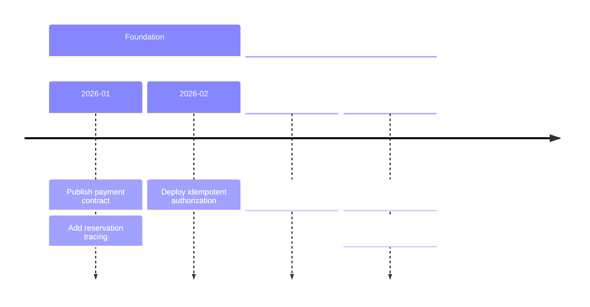

# Checkout migration milestones

Family detector: `timeline`.

```mermaid
---
config: {"themeVariables":{"cScaleLabel1":"#fff","cScale1":"#fff"}}
---
timeline
  section Foundation
    2026-01 : Publish payment contract : Add reservation tracing
    2026-02 : Deploy idempotent authorization
  section Expansion
    2026-03 : Pilot regional fulfilment
    2026-04 : Enable refund reconciliation : Retire batch settlement
```
