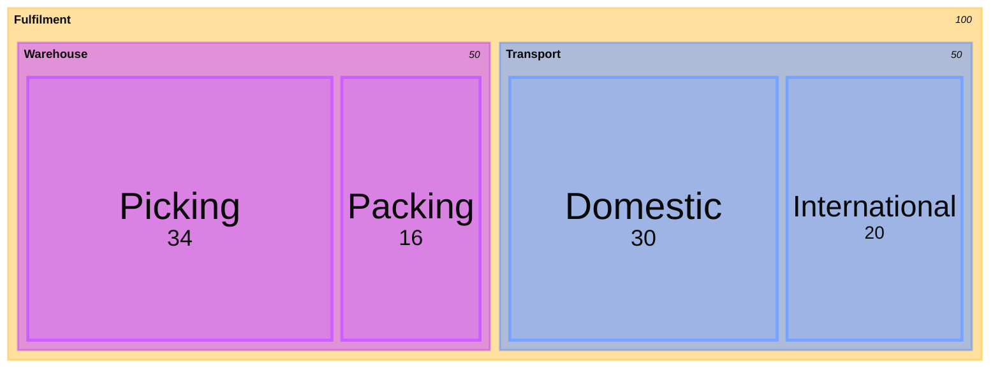

# Monthly fulfilment costs

Family detector: `treemap`.

```mermaid
---
config:
  theme: base
  themeVariables:
    textColor: '#0a0a0a'
    primaryTextColor: '#0a0a0a'
    scaleLabelColor: '#0a0a0a'
---
treemap-beta
"Fulfilment"
  "Warehouse"
    "Picking": 34
    "Packing": 16
  "Transport"
    "Domestic": 30
    "International": 20
```
