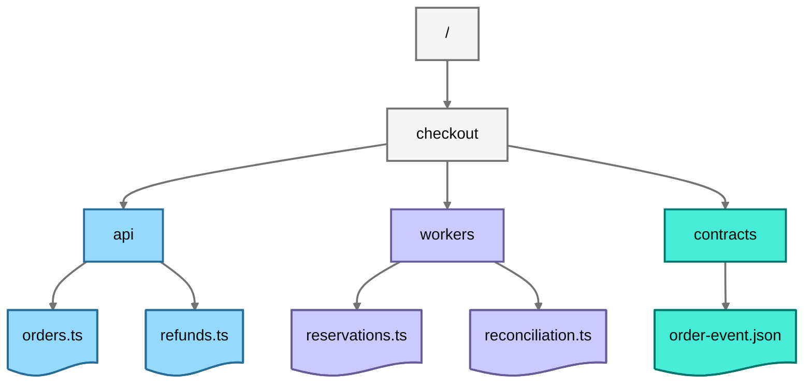

# Checkout repository ownership

Family detector: `treeView`.

```mermaid
---
config:
  layout: dagre
  look: classic
  theme: base
  themeVariables:
    textColor: '#0a0a0a'
    primaryTextColor: '#0a0a0a'
    lineColor: '#737373'
    edgeLabelBackground: '#ffffff'
---
flowchart TB
  N0["/"]
  class N0 root
  N1["checkout"]
  class N1 root
  N0 --> N1
  N2["api"]
  class N2 api
  N1 --> N2
  N3@{shape: doc, label: "orders.ts"}
  class N3 api
  N2 --> N3
  N4@{shape: doc, label: "refunds.ts"}
  class N4 api
  N2 --> N4
  N5["workers"]
  class N5 workers
  N1 --> N5
  N6@{shape: doc, label: "reservations.ts"}
  class N6 workers
  N5 --> N6
  N7@{shape: doc, label: "reconciliation.ts"}
  class N7 workers
  N5 --> N7
  N8["contracts"]
  class N8 contracts
  N1 --> N8
  N9@{shape: doc, label: "order-event.json"}
  class N9 contracts
  N8 --> N9
  classDef root fill:#f5f5f5,color:#0a0a0a,stroke:#737373,stroke-width:2px
  classDef api fill:#96d9ff,color:#0a0a0a,stroke:#266d97,stroke-width:2px
  classDef workers fill:#cbc9ff,color:#0a0a0a,stroke:#675b99,stroke-width:2px
  classDef contracts fill:#46ecd5,color:#0a0a0a,stroke:#00776e,stroke-width:2px
  linkStyle default stroke:#737373,stroke-width:2px
```
