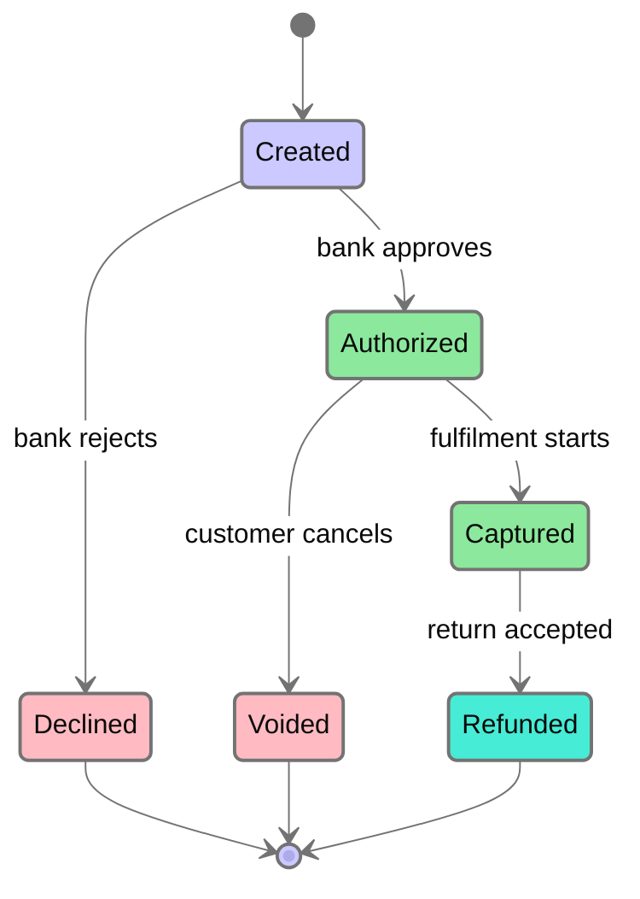

# Legacy payment lifecycle

Family detector: `stateDiagram`.

```mermaid
---
config:
  theme: base
  themeVariables:
    primaryTextColor: '#0a0a0a'
    textColor: '#0a0a0a'
    stateLabelColor: '#0a0a0a'
    primaryColor: '#cbc9ff'
    mainBkg: '#cbc9ff'
    stateBkg: '#cbc9ff'
    lineColor: '#737373'
    transitionColor: '#737373'
    edgeLabelBackground: '#ffffff'
---
stateDiagram
  [*] --> Created
  Created --> Authorized : bank approves
  Created --> Declined : bank rejects
  Authorized --> Captured : fulfilment starts
  Authorized --> Voided : customer cancels
  Captured --> Refunded : return accepted
  Declined --> [*]
  Voided --> [*]
  Refunded --> [*]
  classDef pending fill:#cbc9ff,color:#0a0a0a,stroke:#737373,stroke-width:2px
  classDef approved fill:#8ce89c,color:#0a0a0a,stroke:#737373,stroke-width:2px
  classDef rejected fill:#ffbac2,color:#0a0a0a,stroke:#737373,stroke-width:2px
  classDef returned fill:#46ecd5,color:#0a0a0a,stroke:#737373,stroke-width:2px
  class Created pending
  class Authorized,Captured approved
  class Declined,Voided rejected
  class Refunded returned
```
