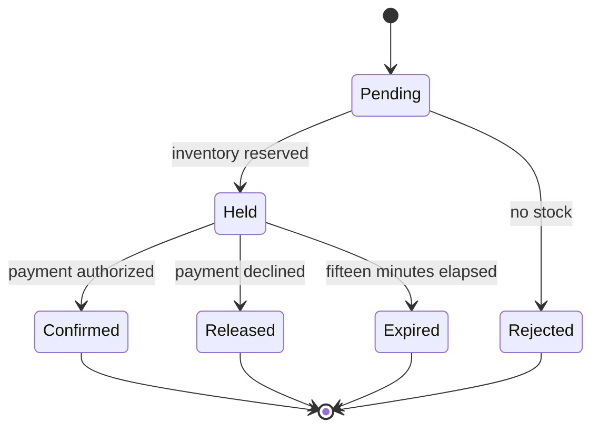

# Reservation lifecycle

Family detector: `state`.

```mermaid
---
config: {"themeVariables":{"primaryTextColor":"#fff","primaryColor":"#fff","mainBkg":"#fff"}}
---
stateDiagram-v2
  [*] --> Pending
  Pending --> Held : inventory reserved
  Pending --> Rejected : no stock
  Held --> Confirmed : payment authorized
  Held --> Released : payment declined
  Held --> Expired : fifteen minutes elapsed
  Confirmed --> [*]
  Rejected --> [*]
  Released --> [*]
  Expired --> [*]
```
